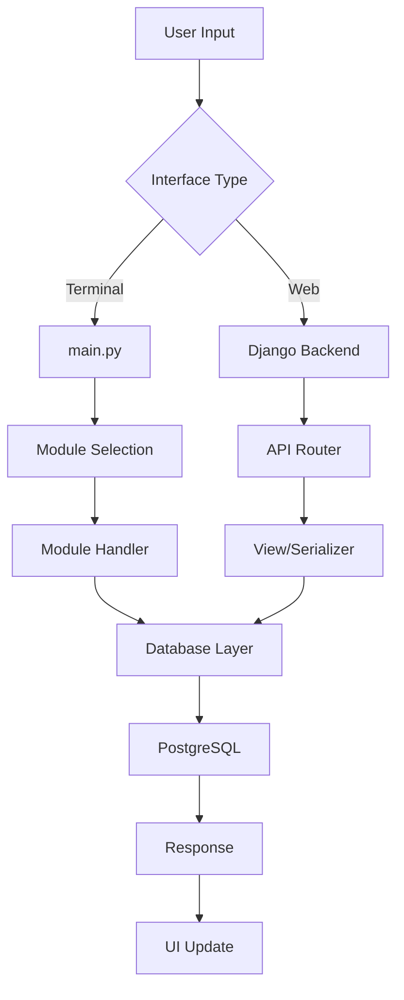

# UNIBOS System Architecture

## Quick Navigation
- [README.md](README.md) - Main project documentation
- [DEVELOPMENT.md](DEVELOPMENT.md) - Development guide
- [PROJECT_STRUCTURE.md](PROJECT_STRUCTURE.md) - Directory organization

## Table of Contents
- [Overview](#overview)
- [System Components](#system-components)
- [Technology Stack](#technology-stack)
- [Module Architecture](#module-architecture)
- [Data Flow](#data-flow)
- [Security Architecture](#security-architecture)
- [Deployment Architecture](#deployment-architecture)
- [Evolution Timeline](#evolution-timeline)

## Overview

UNIBOS (Unicorn Bodrum Operating System) is a modular, multi-purpose operating system platform that evolved from a simple Raspberry Pi-based system (v001) to a comprehensive enterprise-ready platform (v429). The system combines terminal-based UI with web interfaces, supporting both offline-first and cloud-connected operations.

### Core Philosophy
- **Modular Design**: Each functionality is a self-contained module
- **Offline-First**: Full functionality without internet connection
- **Privacy-Focused**: User data stays local unless explicitly shared
- **Progressive Enhancement**: Graceful degradation from advanced to basic features

## System Components

### 1. Core System (`/src`)
The heart of UNIBOS, written in Python 3.8+

```
src/
├── main.py                    # Main entry point (Terminal UI)
├── VERSION.json               # Version tracking
├── translations.py            # i18n support (10 languages)
├── database_config.py         # Database abstraction layer
├── git_manager.py            # Version control integration
├── screenshot_manager.py      # Screenshot archival system
├── communication_logger.py    # Development session tracking
└── ui_architecture.py        # Terminal UI framework
```

### 2. Backend System (`/backend`)
Django-based backend supporting web interfaces and APIs

```
backend/
├── manage.py                  # Django management
├── apps/
│   ├── authentication/       # JWT-based auth with 2FA
│   ├── users/               # User management
│   ├── currencies/          # Financial tracking
│   ├── personal_inflation/  # Inflation calculation
│   ├── documents/           # OCR and document management
│   ├── wimm/               # Where Is My Money
│   ├── wims/               # Where Is My Stuff
│   ├── cctv/               # Camera monitoring
│   └── recaria/            # Space exploration game
└── unibos_backend/         # Core backend configuration
```

### 3. Archive System (`/archive`)
Comprehensive versioning and backup system

```
archive/
├── versions/               # 429 versions (v001 to v429)
├── communication_logs/     # Development session logs
├── backups/               # Automated backups
└── reports/               # System analysis reports
```

## Technology Stack

### Programming Languages
- **Python 3.11+**: Core system and backend
- **JavaScript**: Web interfaces and game engine
- **Bash**: System scripts and automation
- **SQL**: Database queries

### Frameworks & Libraries

#### Backend
- **Django 4.2+**: Web framework
- **Django REST Framework**: API development
- **Celery**: Async task processing
- **Channels**: WebSocket support

#### Frontend
- **Terminal UI**: Custom curses-based interface
- **Phaser.js 3.70+**: Game engine (Recaria)
- **Leaflet 1.9+**: Map integration
- **Bootstrap 5**: Web UI components

#### Database
- **PostgreSQL 15+**: Primary database (required)
- **PostGIS**: Spatial data extension
- **Redis 7+**: Caching and sessions

#### Infrastructure
- **Docker**: Containerization
- **Nginx**: Reverse proxy
- **Gunicorn**: WSGI server
- **GitHub Actions**: CI/CD

## Module Architecture

### Core Modules

#### 1. WIMM (Where Is My Money)
Financial management system with multi-currency support
- Transaction tracking
- Invoice management
- Budget planning
- Financial reports
- Cross-module integration with Documents

#### 2. WIMS (Where Is My Stuff)
Inventory and asset management
- Warehouse management
- Stock tracking
- Batch/Serial numbers
- Expiry alerts
- QR code integration

#### 3. Currencies
Real-time financial tracking
- Live exchange rates (TCMB, Binance, CoinGecko)
- Portfolio management
- Price alerts
- Market analysis
- WebSocket updates

#### 4. Personal Inflation (Kişisel Enflasyon)
Individual inflation calculation based on personal consumption
- Product price tracking
- Store management
- Basket creation
- Trend analysis
- Receipt OCR integration

#### 5. Documents
Advanced document management with OCR
- Tesseract OCR integration
- Receipt parsing
- Credit card management
- Subscription tracking
- Auto-categorization

#### 6. CCTV
Professional camera monitoring system
- TP-Link Tapo camera support (C200, C210, C310, C320WS)
- Multi-camera grid views
- Recording management
- Motion detection
- PTZ control

#### 7. Recaria
Space exploration game
- Isometric view
- Real-world map integration
- Resource management
- Multiplayer support
- Progressive world expansion

#### 8. Birlikteyiz
Emergency communication network
- LoRa mesh networking
- GPS coordination
- Offline messaging
- Disaster zone monitoring
- 15km range communication

## Data Flow

### Request Lifecycle



### Data Storage Strategy

1. **User Data**: PostgreSQL for all environments
2. **Cache**: Redis for session and temporary data
3. **Files**: Organized directory structure with date-based archiving
4. **Backups**: Automated versioning with git integration

## Security Architecture

### Authentication Layers
1. **Terminal UI**: Local system authentication
2. **Web Interface**: JWT with refresh tokens
3. **API Access**: Bearer token authentication
4. **2FA Support**: TOTP-based two-factor authentication

### Data Protection
- **Encryption**: AES-256 for sensitive data
- **Hashing**: bcrypt for passwords
- **SSL/TLS**: Enforced for all web traffic
- **Input Validation**: Comprehensive sanitization
- **Rate Limiting**: DDoS protection

### Permission System
```python
ROLES = {
    'super_admin': ['*'],
    'admin': ['manage_users', 'manage_system'],
    'manager': ['manage_department', 'view_reports'],
    'developer': ['debug', 'deploy'],
    'user': ['basic_access'],
    'guest': ['view_only']
}
```

## Deployment Architecture

### Development Environment
```bash
# Local development
python src/main.py              # Terminal UI
python backend/manage.py runserver  # Web interface
```

### Production Environment
```bash
# Docker deployment
docker-compose up -d

# Systemd service
systemctl start unibos.service
```

### Scaling Strategy
1. **Horizontal Scaling**: Load balancer + multiple Django instances
2. **Database Replication**: Master-slave PostgreSQL setup
3. **Caching Layer**: Redis cluster
4. **CDN Integration**: Static file distribution

## Evolution Timeline

### Phase 1: Foundation (v001-v050)
- Basic Raspberry Pi system
- Core modules (Recaria, Birlikteyiz)
- PostgreSQL database
- Simple CLI interface

### Phase 2: Expansion (v051-v150)
- Currency tracking added
- Personal inflation calculator
- Terminal UI improvements
- Multi-language support

### Phase 3: Web Integration (v151-v250)
- Django backend integration
- Web interface development
- API creation
- User authentication system

### Phase 4: Enterprise Features (v251-v350)
- WIMM and WIMS modules
- CCTV integration
- Document OCR system
- Advanced role management

### Phase 5: Optimization (v351-v429)
- Performance improvements
- UI/UX refinements
- Bug fixes and stability
- Archive system enhancement

## Performance Metrics

### Target Specifications
- **Response Time**: <100ms for UI interactions
- **Concurrent Users**: 1000+ simultaneous users
- **Database Queries**: <50ms average query time
- **OCR Processing**: <2s per document
- **Uptime**: 99.9% availability

### Resource Requirements

#### Minimum
- CPU: 2 cores
- RAM: 2GB
- Storage: 10GB
- Python: 3.8+

#### Recommended
- CPU: 4+ cores
- RAM: 8GB+
- Storage: 50GB+ SSD
- Python: 3.11+

## Future Roadmap

### Planned Features
1. **Mobile Apps**: iOS/Android native applications
2. **AI Integration**: Advanced OCR and predictive analytics
3. **Blockchain**: Decentralized data verification
4. **IoT Expansion**: Smart home integration
5. **Cloud Sync**: Optional cloud backup and sync

### Architecture Improvements
1. **Microservices**: Module separation for better scaling
2. **GraphQL**: Alternative to REST API
3. **Real-time Sync**: WebSocket for all modules
4. **Machine Learning**: Predictive analysis and automation

## Conclusion

UNIBOS represents a unique approach to creating a comprehensive operating system that prioritizes user privacy, offline functionality, and modular extensibility. From its humble beginnings as a Raspberry Pi project to its current state as an enterprise-ready platform, the architecture has been designed to be both robust and flexible, allowing for continuous evolution while maintaining backward compatibility.

---

## Related Documentation
- [FEATURES.md](FEATURES.md) - Complete feature list
- [INSTALLATION.md](INSTALLATION.md) - Setup instructions
- [API.md](API.md) - API documentation
- [VERSION_MANAGEMENT.md](VERSION_MANAGEMENT.md) - Version control

---

*Last Updated: 2025-08-12*  
*Version: Architecture Document v2.0*  
*Current UNIBOS Version: v446+*